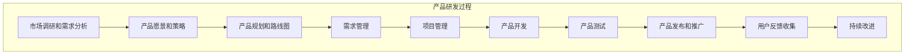

### 产品经理是什么？

产品经理（Product Manager，简称PM）是负责产品规划、开发和市场推广的专业人员。他们在产品生命周期的各个阶段起到关键作用，确保产品满足市场需求并实现商业目标。

### 产品经理需要什么技能？

1. **市场调研和分析**：
   - 了解市场趋势、竞争对手和用户需求。
   - 进行市场调研和数据分析。

2. **产品规划和策略**：
   - 制定产品愿景和路线图。
   - 设定产品目标和优先级。

3. **项目管理**：
   - 管理产品开发过程，确保按时交付。
   - 协调跨职能团队，包括开发、设计、营销和销售。

4. **沟通和协作**：
   - 与利益相关者（如客户、团队成员和高层管理人员）保持有效沟通。
   - 组织和主持会议，确保团队对产品目标和进展有清晰的理解。

5. **技术知识**：
   - 了解基本的技术概念和开发流程。
   - 能够与技术团队有效沟通。

6. **用户体验设计**：
   - 关注用户体验，确保产品易用且满足用户需求。
   - 进行用户测试和反馈收集。

7. **商业敏锐度**：
   - 理解商业模式和盈利策略。
   - 制定定价策略和市场推广计划。

### 产品经理如何开展工作？

1. **市场调研**：
   - 进行市场分析，了解用户需求和竞争态势。
   - 收集和分析用户反馈。

2. **制定产品愿景和策略**：
   - 确定产品的目标市场和用户群体。
   - 制定产品愿景和长期发展策略。

3. **产品规划和路线图**：
   - 制定产品路线图，确定产品的开发阶段和里程碑。
   - 设定优先级，确保关键功能按时交付。

4. **需求管理**：
   - 收集和整理产品需求，创建需求文档。
   - 与开发团队讨论需求，确保理解一致。

5. **项目管理**：
   - 监督产品开发进度，确保按时交付。
   - 解决开发过程中遇到的问题和挑战。

6. **产品发布和推广**：
   - 制定产品发布计划，协调各部门的工作。
   - 进行市场推广，确保产品成功上市。

7. **持续改进**：
   - 收集用户反馈，分析产品性能。
   - 迭代产品，持续改进用户体验和功能。

通过以上步骤，产品经理能够有效地管理产品开发过程，确保产品满足市场需求并实现商业目标。

### 高端电子监控产品设计方案

#### 1. 市场调研和需求分析
- **目标市场**：中国最高端养老院。
- **用户需求**：
  - 实时监控老人的生命体征、位置和身体状态。
  - 及时报警和通知护理人员。
  - 数据分析用于健康管理和预防。
- **竞争态势**：分析现有市场上的监控产品，找出差异化优势。

#### 2. 产品愿景和策略
- **产品愿景**：提供全面、智能、安全的老人监控解决方案，提升养老院的服务质量和老人生活质量。
- **长期策略**：
  - 持续改进产品功能和用户体验。
  - 扩展市场，覆盖更多高端养老院。

#### 3. 产品规划和路线图
- **产品路线图**：
  - **第一阶段**：基础监控功能开发（红外线摄像头、生命体征传感器）。
  - **第二阶段**：数据传输和存储（WiFi/5G传输、数据中心）。
  - **第三阶段**：数据分析和报警系统。
  - **第四阶段**：用户界面和体验优化。
- **优先级设定**：确保关键功能（如生命体征监控和报警）优先开发和测试。

#### 4. 需求管理
- **需求收集**：
  - 与养老院管理人员和护理人员沟通，了解具体需求。
  - 收集用户反馈，调整需求。
- **需求文档**：
  - 创建详细的需求文档，列出所有功能和性能要求。
- **需求讨论**：
  - 与开发团队讨论需求，确保理解一致。

#### 5. 项目管理
- **开发进度监督**：
  - 使用项目管理工具（如JIRA）跟踪开发进度。
  - 定期召开项目会议，解决开发过程中遇到的问题。
- **问题解决**：
  - 及时处理开发中的技术和非技术问题，确保项目按时交付。

#### 6. 产品发布和推广
- **发布计划**：
  - 制定详细的发布计划，确保各部门协调一致。
  - 进行内部测试和用户测试，确保产品质量。
- **市场推广**：
  - 制定市场推广策略，通过线上和线下渠道推广产品。
  - 与养老院合作，进行产品演示和试用。

#### 7. 持续改进
- **用户反馈收集**：
  - 定期收集用户反馈，分析产品性能和用户体验。
- **产品迭代**：
  - 根据反馈和数据分析结果，持续改进产品功能和用户体验。
  - 定期发布更新，保持产品竞争力。

### 具体技术方案

#### 硬件部分
- **红外线摄像头**：
  - 高分辨率摄像头，支持夜视功能。
  - 内置红外传感器，实时监控老人活动。
- **生命体征传感器**：
  - 心率、血压、体温等传感器，实时监测老人健康状态。
- **位置传感器**：
  - GPS或室内定位技术，实时跟踪老人位置。

#### 软件部分
- **数据传输**：
  - 支持WiFi和5G网络，确保数据实时传输。
- **数据中心**：
  - 云端数据存储和处理，支持大数据分析。
- **报警系统**：
  - 实时分析数据，发现异常情况立即报警。
  - 多种报警方式（如短信、电话、APP通知）。

#### 用户界面
- **护理人员端**：
  - 实时监控界面，显示老人生命体征和位置。
  - 报警通知界面，提供详细的报警信息和处理建议。
- **管理人员端**：
  - 数据分析界面，提供健康趋势分析和报告。
  - 系统管理界面，支持设备管理和权限设置。
- **用户端**：
  - 实时监控界面，显示老人生命体征和位置。
  - 数据分析界面，提供健康趋势分析和报告

通过以上详细方案，产品经理可以有效地设计和实施高端电子监控产品，满足中国最高端养老院的需求，提升养老服务质量。

### 国内竞品

1. **海康威视（Hikvision）**：
   - 提供多种类型的红外摄像头，广泛应用于安防和监控领域。
   - 产品包括智能摄像头、热成像摄像头等，支持高分辨率和夜视功能。

2. **大华股份（Dahua Technology）**：
   - 提供全面的监控解决方案，包括红外摄像头。
   - 产品具有高分辨率、夜视和智能分析功能。

3. **小米（Xiaomi）**：
   - 提供智能家居产品，包括红外摄像头。
   - 产品支持远程监控、夜视和移动侦测功能。

4. **360智能摄像头（360 Smart Camera）**：
   - 提供家庭和商业用途的智能摄像头。
   - 产品支持红外夜视、移动侦测和云存储。

### 国际竞品

1. **Nest Cam（Google Nest）**：
   - 提供智能家居监控摄像头，支持红外夜视和高清录像。
   - 产品集成Google Assistant，支持智能家居生态系统。

2. **Arlo**：
   - 提供高端无线监控摄像头，支持红外夜视和高清录像。
   - 产品具有防水、防尘设计，适用于室内外监控。

3. **Ring（Amazon）**：
   - 提供智能家居监控摄像头，支持红外夜视和高清录像。
   - 产品集成Amazon Alexa，支持智能家居生态系统。

4. **FLIR Systems**：
   - 提供专业级热成像和红外摄像头，广泛应用于安防、工业和医疗领域。
   - 产品具有高分辨率和精准的热成像功能。

这些国内外竞品在功能和性能上各有特色，可以通过分析这些竞品的优缺点，制定差异化的产品策略，提升自身产品的竞争力。
比如我们的产品可以增加语音监听和通话功能，通过语音识别实现呼叫报警等
